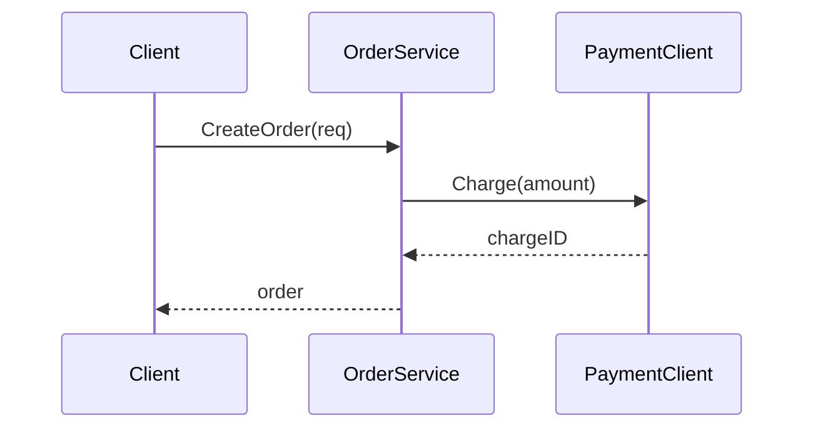
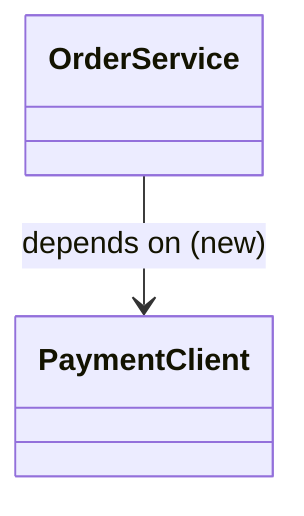
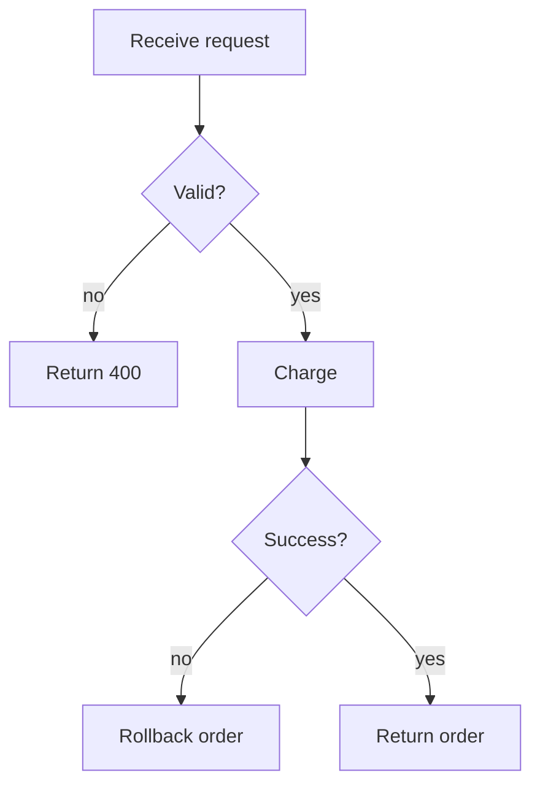

# PR Visual Review

## Core principles

Diagrams are a means, not the goal. The goal is to let a reviewer **grasp the structure of a change quickly and
correctly**. From that premise, three things are non-negotiable. Understand *why* each matters, not just the rule.

1. **A wrong diagram is worse than no diagram.** If the model fabricates a call order or misses a branch, it gives
   the reviewer false confidence and actively lowers review quality. So every diagram MUST be grounded in the real
   code.
2. **Do not draw for every PR.** A one-line fix does not need a sequence diagram. Always-on generation creates review
   fatigue and trains people to skim past diagrams. Restrict output to PRs with structural impact.
3. **Attach an inferred intent to bootstrap a spec-writing culture.** Even on a team not used to spec-in-PR, emitting
   "this PR appears to intend X" turns spec-writing from a blank page into a quick correction. If it's wrong, the
   author is motivated to fix it. This is the skill's hidden value.

---

## Workflow

### Step 1. Gating — decide whether to draw at all

Look at the full diff and the list of changed files, then classify the change. Remember that **"no diagram" is a
legitimate deliverable.**

| Nature of the change | Recommended action |
|---|---|
| New processing flow / new interaction between services or components | sequence diagram |
| Changes to types, interfaces, dependencies, or inheritance structure | class diagram |
| Added or reworked branching / state transitions / conditional logic | flowchart |
| Behavior-preserving refactor (structure changes, flow unchanged) | class diagram, or a single before/after |
| Local logic fix / bug fix (no effect on call structure) | state **no diagram needed** |
| Config, docs, or tests only | state **no diagram needed** |

When the scale makes structural impact hard to judge, ground first (Step 2), then re-classify.

### Step 2. Grounding — capture the actual structure

**A diff alone is not enough to draw an accurate diagram.** Looking only at changed lines forces you to guess callers
and callees, which violates principle 1. Always verify the following against the real code:

- Trace the **callers and callees** of the changed functions/methods, reaching into surrounding files.
- Check for control flow that doesn't appear in the diff: async, event-driven, dependency injection, etc.
- Capture the *prior* structure too, so you can render before/after.
- **Distinguish what you confirmed from what you inferred.** Mark inferred relationships explicitly later on the diagram.

If the files needed for grounding live outside the current context (e.g. a sibling repo), use the
`cross-repo-context` skill alongside this one.

### Step 3. Choose the diagram type and keep scope small

- **One diagram, one concern.** Don't cram everything into one. Large sequence diagrams become unreadable.
- **Scope to the surface the diff touches.** Don't redraw unrelated existing flows.
- Prefer **before / after** when it clarifies the change. What a reviewer actually wants is the *delta*, not a full
  picture of the current state.

### Step 4. Generate the inferred-intent block

Before the diagram, state in 2–4 lines what the change appears to be trying to do structurally. Phrase it so the
author can **just correct it** — not too assertive, and verifiable (see output template).

### Step 5. Make it verifiable

So reviewers can check rather than trust the diagram blindly, **annotate each node with the `file:function` it maps
to.** Mark any inferred edge or node with "(inferred)". This is what makes principle 1 (avoiding false confidence)
actually hold.

---

## Output format

Always produce Markdown in this structure (embed Mermaid inline so it can be pasted directly into a GitHub PR comment).

```markdown
## 🔍 Structural review: <PR title>

### Inferred intent (please confirm)
This PR appears to be **<inferred intent>** structurally.
- [ ] This understanding is correct
- [ ] Not quite → actual intent: ___________

### What changed (structural summary)
<2–3 lines of prose. Never ship the diagram alone.>

### Diagram
\`\`\`mermaid
<sequence / class / flowchart>
\`\`\`

### Node mapping (for verification)
| Element in diagram | Maps to | Note |
|---|---|---|
| OrderService | `order/service.go:CreateOrder` | |
| PaymentClient | `payment/client.go:Charge` | call order inferred |

### Review focus
<Checkpoints surfaced by the diagram. e.g. "New flow calls B after A. If B fails, is A rolled back?">
```

### Minimal Mermaid examples

**sequence (new flow / cross-component interaction):**


**class (type / dependency changes):**


**flowchart (branching / state transitions):**


---

## Anti-patterns (do NOT)

- **Emit a diagram for an irrelevant PR.** If Step 1 says "not needed", just reply "No structural change; diagram
  omitted."
- **Draw from the diff alone.** Never fill in call relationships by guessing without grounding.
- **Produce one giant diagram.** Split by concern.
- **Render inferences as facts.** Always flag uncertain edges with "(inferred)".
- **Ship the diagram without a prose summary.** The diagram aids reading; it is not the conclusion.

---

## Evaluating this skill (for your own PoC)

Evaluate two distinct kinds of correctness separately.

- **Consistency (no spec required, automatable):** Do the `file:function` entries in the node mapping match the real
  code? Does the diagram contradict the diff?
- **Intent fit (measurable when a spec exists):** Did the inferred intent match the author's intent? Use the subset of
  PRs that already carry a spec as a pilot cohort to measure this.

Consistency checks run even where spec-in-PR isn't adopted yet. Also exploit the fact that corrections to the
inferred-intent block become labeled data for intent-fit evaluation.

---

## PoC logging (personal — strip this section before sharing with the team)

After finishing a review — **including a "no diagram needed" decision**, which is valuable gating data — append one
entry to the PoC log.

**Log path (edit this one line):**

```
LOG = /ABSOLUTE/PATH/TO/PROJECT/tmp/poc-log.md
```

- Use an **absolute** path to pin every entry to one project's `tmp/`, regardless of which repo the reviewed PR lives
  in (e.g. `/Users/you/work/myapp/tmp/poc-log.md`). This is what "output to a specific project's tmp dir" requires.
- A relative `tmp/poc-log.md` would instead resolve against the current working directory, so logs scatter into
  whichever repo you happen to be reviewing. Only use relative if that's what you want.

**Behavior:**

- If `tmp/` or the file doesn't exist, create them, seeding the file with the header + tally block below, then add the
  entry.
- **Append only.** Never overwrite or rewrite existing entries.
- Fill the entry from this run; leave the checkboxes unchecked for the human to mark.
- Do **not** recompute the rolling tally each run — read-modify-write on that table is error-prone. Leave it for an
  on-demand tally pass.
- `tmp/` is gitignored by convention in most repos; confirm it is, so the log never lands in a commit.

**Seed (only when creating the file):**

```markdown
# pr-visual-review — PoC log

| Signal | ✅ | ⚠️ | ❌ | n |
|---|---|---|---|---|
| Gating | 0 | 0 | 0 | 0 |
| Consistency | 0 | 0 | 0 | 0 |
| Intent fit | 0 | 0 | 0 | 0 |
```

**Entry to append each run:**

```markdown
---
### <repo>#<num> — <title>  (YYYY-MM-DD)
- type: [flow|types|branching|refactor|local|config] → decided: [seq|class|flow|before-after|NONE]
- Gating:      [ ]✅ [ ]⚠️ [ ]❌FP(noise) [ ]❌FN(missed) — note:
- Consistency: [ ]✅ [ ]⚠️ [ ]❌wrong-edge — wrong edges:
- Intent fit:  [ ]✅ [ ]⚠️ [ ]❌ [ ]n/a — guessed vs actual:
- Useful:      [ ]clearly [ ]marginally [ ]no — surfaced/missed:
- Skill fix:
```

---

> v1 draft. Expect to tune the gating granularity and the inferred-intent wording via evals while running it on real PRs.
