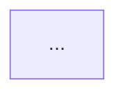

# repo-deepwiki

Produce a [DeepWiki](https://deepwiki.com)-style architecture wiki for a target
code repository. (An independent skill inspired by DeepWiki's format; not
affiliated with or endorsed by Cognition.) The defining trait of this format is
**verifiability**: every non-trivial claim is backed by an inline `file:line`
citation that links to the exact source. You write the wiki by **reading the
real code**, never by guessing from the README or project fame.

## When to use

Trigger when the user wants to understand or document a whole repository's
structure — onboarding to an unfamiliar codebase, producing an architecture
overview, "make a DeepWiki / wiki / ARCHITECTURE.md for this repo", or mapping
the key subsystems and components. NOT for documenting a single function, a PR
diff (use `pr-visual-review`), or end-user/API reference docs.

## Inputs

The target repo is, in priority order:
1. An explicit path or GitHub URL the user gives. If a URL to a repo not present
   locally, `git clone --depth 1` it into a temp dir (ask first if it's large).
2. Otherwise the current working directory.

Resolve these facts up front (they drive citations and the header):
- `owner/repo` and remote host — `git remote get-url origin` (normalize `git@`/`ssh://` → `https://`).
- Pinned commit — `git rev-parse HEAD` (cite against this SHA so links never rot).
- Commit date — `git show -s --format=%ci HEAD`.
- Default branch — `git symbolic-ref --short HEAD` or `origin/HEAD`.

If the repo has no git remote, still cite `path:line` but render them as inline
`code` (no hyperlink) and note in the header that links are unavailable.

## Process

1. **Survey before writing.** Map the repo's shape, don't dive in blind:
   - Build/manifest files (`go.mod`, `package.json`, `Cargo.toml`, `pyproject.toml`,
     `pom.xml`, `Makefile`, etc.) → language(s), entry points, how it builds/runs.
   - Top-level directory layout (the real structural skeleton).
   - Entry points (`main.*`, `cmd/`, `src/index.*`, server bootstraps).
   - Existing docs (`README`, `docs/`, `CONTRIBUTING`, ADRs) as *hints to verify*, not gospel.
   For large repos, fan out parallel Explore/general-purpose subagents — one per
   candidate subsystem — and have each return key files, entities, and `file:line`
   anchors. Tell each subagent to emit citations in the `{{cite:...}}` macro form
   (see step 6) and return a ready-to-paste Markdown fragment; synthesize, don't
   copy raw dumps.
2. **Derive the section hierarchy.** Numbered, DeepWiki-style:
   `1 Overview` → one section per major subsystem (decimal subsections `2.1`,
   `2.2`… where a subsystem has distinct parts) → final `N Glossary`. Let the
   code's real seams decide the sections (control plane / node, training /
   generation, gateway / providers…). Aim for 5–9 top-level sections; don't
   invent structure the code doesn't have.
3. **Write each section against the source.** For every section:
   - A short intro paragraph: what this subsystem is and why it exists.
   - **Key Code Entities** — bulleted list of the load-bearing types/functions/
     files, each with a citation and a one-line role.
   - A **table** where it clarifies (Directory/Purpose, Component/Purpose/Key Types,
     Platform/Role/Technology).
   - Inline citations on every concrete claim. Symbol names in `backticks`.
   - End with a `**Sources:**` line listing the files the section draws on.
4. **One architecture Mermaid diagram** in the Overview (component or flow graph)
   when it genuinely aids comprehension — small, accurate, and **laid out so text
   never overlaps**. Overlap is the #1 rendering failure; prevent it by design:
   - **Short edge labels — 1–3 words.** Long labels are the main cause of overlap.
     Put detail in the node box or the prose, not on the edge (`|watch / status|`,
     not `|watch pods, post status|`).
   - **Group nodes into `subgraph`s** by tier (control plane / worker node / client)
     and keep a node's neighbors inside its own subgraph where possible. Minimize
     edges that cross a subgraph boundary, and keep any that do **label-light**.
   - **Avoid a single node that many long-labelled edges converge on** placed right
     next to a subgraph — give convergence points their own rank.
   - Cap at ~8–12 nodes; declare nodes in flow order to reduce crossings. Wrap text
     inside a box with `<br/>` if needed — never to widen edge labels.
   - Prefer `flowchart TB`/`LR` with explicit direction. One diagram only; if it
     can't stay legible, simplify the scope or drop it.
5. **Glossary** — project-specific terms a newcomer would stumble on, each defined
   in one line, cited where the term is defined in code.
6. **Assemble, expand & validate**, then write the single output file (below).
   When subagents (or you) emit citations as `{{cite:RELPATH:START-END}}` /
   `{{cite:RELPATH:LINE}}` / `{{cite:RELPATH}}` macros, run one pass that expands
   each to a full SHA-pinned link **and** verifies it: the path exists and the line
   range is within the file. This is the reliability backbone for large, multi-
   subagent runs — it guarantees consistent URLs and catches any fabricated or
   stale range before the wiki ships. A minimal expander/validator:

   ```python
   import re, pathlib
   SHA, OWNER_REPO = "<full-sha>", "<owner>/<repo>"
   base = f"https://github.com/{OWNER_REPO}/blob/{SHA}/"
   src = pathlib.Path("wiki.md").read_text(); problems = []
   def repl(m):
       body = m.group(1)
       if re.search(r":\d+(-\d+)?$", body):
           path, lines = body.rsplit(":", 1); s, _, e = lines.partition("-"); e = e or s
           n = len(pathlib.Path(path).read_text().splitlines()) if pathlib.Path(path).exists() else None
           if n is None: problems.append(f"missing {path}")
           elif int(e) > n: problems.append(f"range {path}:{lines} > {n}")
           anchor = f"#L{s}" + (f"-L{e}" if e != s else "")
           return f"[{path}:{lines}]({base}{path}{anchor})"
       if not pathlib.Path(body).exists(): problems.append(f"missing {body}")
       return f"[{body}]({base}{body})"
   out = re.sub(r"\{\{cite:([^}]+)\}\}", repl, src)
   pathlib.Path("wiki.md").write_text(out)
   print("UNRESOLVED:", out.count("{{cite"), "PROBLEMS:", problems or "none")
   ```

   Fix or drop anything the validator flags (and spot-check a few ranges for
   semantic accuracy — bounds-valid ≠ points at the claimed symbol). If you are
   not using the macro form, still verify every link's path and range by hand.

## Citation rules (the core discipline)

- Format: `[path/to/file.ext:120-150](URL)` where
  `URL = https://github.com/<owner>/<repo>/blob/<SHA>/<path>#L120-L150`.
- Single line: `:42` / `#L42`. Pin to the **commit SHA**, never a branch name.
- **Only cite what you actually read.** No citation for a claim you didn't verify
  in the source. If unsure, read the file or drop the claim. Never fabricate
  line numbers — re-read to confirm the range.
- Prefer 1–3 tight citations per claim over a wall of links.
- **Validate before shipping** — every cited path must exist and every range must
  be within the file (see the step-6 expander/validator). A wiki that ships a
  broken link has failed its one job.

## Output

Write to **`wiki.md`** at the repo root (or the path the user names). Overwrite
only after showing the user; if a `wiki.md` exists and wasn't written by this
skill, confirm first. Template:

```markdown
# <repo> — Architecture Wiki

> Generated by analyzing the source at commit `<short-sha>` (<commit date>).
> Citations link to <owner>/<repo> pinned at that commit.

## Contents
1. [Overview](#1-overview)
2. [<Subsystem>](#2-...)
   - 2.1 [...](#21-...)
...
N. [Glossary](#n-glossary)

---

## 1. Overview

<One sentence: what this project IS.> <Design philosophy / shape in a few lines.>



**Key Code Entities**
- `Foo` — does X. [path/foo.go:10-40](url)
- ...

**Sources:** [path/foo.go](url), [cmd/main.go](url)

---

## 2. <Subsystem>
...

---

## N. Glossary
- **Term** — one-line definition. [path:line](url)
```

## Quality bar

- Citation-dense and **accurate** — a reader can click any claim and land on the
  proving code. Accuracy beats coverage; a smaller wiki that's all-correct wins.
- Reflects the *actual* architecture (the seams the code reveals), not a generic
  template or the project's marketing.
- Skimmable: numbered TOC, short paragraphs, tables for structured facts, bold
  key terms, `backticks` for symbols.
- Any Mermaid diagram renders cleanly with **no overlapping text** — short edge
  labels, subgraph grouping, few boundary-crossing edges (see step 4).

## Edge cases

- **Huge monorepo:** scope to the subsystems the user cares about; state in the
  header what was and wasn't covered (no silent truncation).
- **Monorepo with packages:** treat each top-level package/service as a section.
- **No remote / local-only:** emit `path:line` as plain `code`, note links are off.
- **Generated/vendored dirs** (`vendor/`, `node_modules/`, `dist/`): exclude from
  analysis; mention their existence once if relevant to the build.
