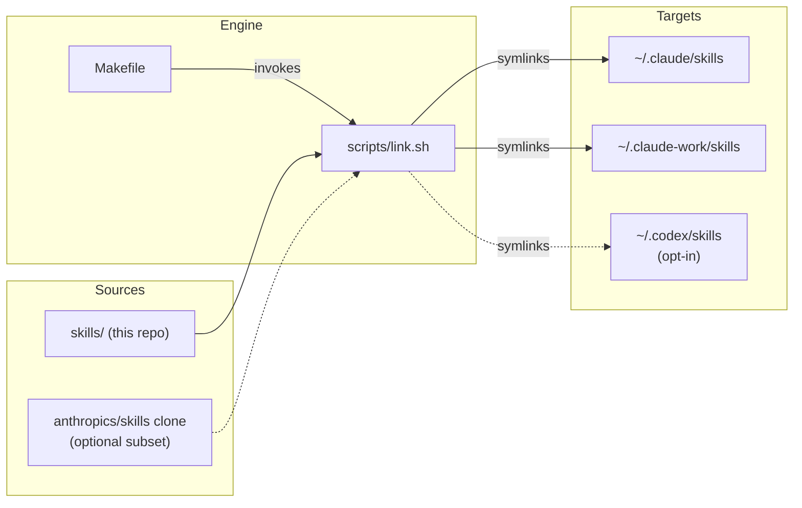

# nsega/agent-skills — Architecture Wiki

> Generated by analyzing the source at commit `12fadce` (2026-06-11).
> Citations link to nsega/agent-skills pinned at that commit.

## Contents
1. [Overview](#1-overview)
2. [Installation engine (link.sh)](#2-installation-engine-linksh)
   - 2.1 [Skill selection](#21-skill-selection)
   - 2.2 [Install states](#22-install-states)
   - 2.3 [Uninstall and status](#23-uninstall-and-status)
3. [Make orchestration](#3-make-orchestration)
4. [Skill catalog](#4-skill-catalog)
5. [Scaffolding new skills](#5-scaffolding-new-skills)
6. [Glossary](#6-glossary)

---

## 1. Overview

This repository is a personal, git-managed collection of [Agent Skills](https://docs.claude.com/en/docs/claude-code/skills) for Claude Code (and, opt-in, Codex). Its design philosophy is **symlink, don't copy**: each skill folder is per-folder symlinked from the repo into one or more skills directories, so editing a skill in the repo takes effect immediately with no install step to re-run. [README.md:6-8](https://github.com/nsega/agent-skills/blob/12fadced7749ac00f378663075c68b74e3164f8a/README.md#L6-L8)

The system has three moving parts: a **Makefile** that defines sources and targets, a **link engine** (`scripts/link.sh`) that creates and audits the symlinks with strict safety rules, and the **skills themselves** (`skills/<name>/SKILL.md`). Two sources feed every target: this repo's own `skills/` directory (all skills), and an optional curated subset of a local [anthropics/skills](https://github.com/anthropics/skills) clone. [README.md:23-30](https://github.com/nsega/agent-skills/blob/12fadced7749ac00f378663075c68b74e3164f8a/README.md#L23-L30)

**Key Code Entities**
- `CLAUDE_SKILLS_DIRS` — space-separated list of target skills dirs, one per Claude Code identity; every Make target loops over it. [Makefile:23](https://github.com/nsega/agent-skills/blob/12fadced7749ac00f378663075c68b74e3164f8a/Makefile#L23)
- `UPSTREAM_REPO` / `UPSTREAM_SKILLS` — where the upstream clone lives and which of its skills get linked (default `mcp-builder skill-creator`). [Makefile:27-28](https://github.com/nsega/agent-skills/blob/12fadced7749ac00f378663075c68b74e3164f8a/Makefile#L27-L28)
- `scripts/link.sh` — the only code that touches the filesystem; implements `install | uninstall | status`. [scripts/link.sh:6-11](https://github.com/nsega/agent-skills/blob/12fadced7749ac00f378663075c68b74e3164f8a/scripts/link.sh#L6-L11)
- `scripts/new.sh` — scaffolds a new skill folder from `templates/SKILL.md`. [scripts/new.sh:3-5](https://github.com/nsega/agent-skills/blob/12fadced7749ac00f378663075c68b74e3164f8a/scripts/new.sh#L3-L5)

**Sources:** [README.md](https://github.com/nsega/agent-skills/blob/12fadced7749ac00f378663075c68b74e3164f8a/README.md), [Makefile](https://github.com/nsega/agent-skills/blob/12fadced7749ac00f378663075c68b74e3164f8a/Makefile), [scripts/link.sh](https://github.com/nsega/agent-skills/blob/12fadced7749ac00f378663075c68b74e3164f8a/scripts/link.sh)

---

## 2. Installation engine (link.sh)

`scripts/link.sh` is a single bash script with a three-command contract — `install`, `uninstall`, `status` — dispatched at the bottom of the file. [scripts/link.sh:135-140](https://github.com/nsega/agent-skills/blob/12fadced7749ac00f378663075c68b74e3164f8a/scripts/link.sh#L135-L140) It runs under `set -euo pipefail` [scripts/link.sh:26](https://github.com/nsega/agent-skills/blob/12fadced7749ac00f378663075c68b74e3164f8a/scripts/link.sh#L26) and takes `<cmd> <target_dir> <src_dir> [skill...]`, where the optional trailing names act as a whitelist. [scripts/link.sh:28-37](https://github.com/nsega/agent-skills/blob/12fadced7749ac00f378663075c68b74e3164f8a/scripts/link.sh#L28-L37)

A non-existent source directory is a **warn-and-skip no-op** (exit 0), which is what lets the Makefile list optional sources — like the upstream clone — that may not exist on every machine. [scripts/link.sh:39-43](https://github.com/nsega/agent-skills/blob/12fadced7749ac00f378663075c68b74e3164f8a/scripts/link.sh#L39-L43)

The ownership test at the heart of every destructive decision is `points_into_src()`: a symlink is only ever touched if its target resolves inside the given source directory. [scripts/link.sh:47-52](https://github.com/nsega/agent-skills/blob/12fadced7749ac00f378663075c68b74e3164f8a/scripts/link.sh#L47-L52)

### 2.1 Skill selection

`selected_skills()` emits the skill names to act on: the explicit whitelist (each name validated to have a `SKILL.md` under the source, with a warning for misses), or — when no whitelist is given — every directory in the source that contains a `SKILL.md`. [scripts/link.sh:56-73](https://github.com/nsega/agent-skills/blob/12fadced7749ac00f378663075c68b74e3164f8a/scripts/link.sh#L56-L73) The whitelist applies to `install`/`status` only; `uninstall` always acts on all links pointing into the source. [scripts/link.sh:8-11](https://github.com/nsega/agent-skills/blob/12fadced7749ac00f378663075c68b74e3164f8a/scripts/link.sh#L8-L11)

### 2.2 Install states

`do_install()` classifies each skill into one of five states, and only two of them write to disk: [scripts/link.sh:75-99](https://github.com/nsega/agent-skills/blob/12fadced7749ac00f378663075c68b74e3164f8a/scripts/link.sh#L75-L99)

| State | Condition | Action |
|---|---|---|
| `ok` | symlink already points at the source skill | none (idempotent) [scripts/link.sh:84-85](https://github.com/nsega/agent-skills/blob/12fadced7749ac00f378663075c68b74e3164f8a/scripts/link.sh#L84-L85) |
| `fixed` | stale symlink that still points into the source repo | repointed with `ln -sfn` [scripts/link.sh:86-88](https://github.com/nsega/agent-skills/blob/12fadced7749ac00f378663075c68b74e3164f8a/scripts/link.sh#L86-L88) |
| `warn` (foreign) | symlink pointing somewhere else | skipped, never clobbered [scripts/link.sh:89-90](https://github.com/nsega/agent-skills/blob/12fadced7749ac00f378663075c68b74e3164f8a/scripts/link.sh#L89-L90) |
| `warn` (non-symlink) | a real file/dir occupies the name | skipped, never clobbered [scripts/link.sh:92-93](https://github.com/nsega/agent-skills/blob/12fadced7749ac00f378663075c68b74e3164f8a/scripts/link.sh#L92-L93) |
| `linked` | nothing there | symlink created [scripts/link.sh:94-96](https://github.com/nsega/agent-skills/blob/12fadced7749ac00f378663075c68b74e3164f8a/scripts/link.sh#L94-L96) |

### 2.3 Uninstall and status

`do_uninstall()` walks the target directory and removes **only** symlinks whose target passes `points_into_src()` — foreign links and real files are untouched, so uninstalling one source repo never disturbs another's links. [scripts/link.sh:101-112](https://github.com/nsega/agent-skills/blob/12fadced7749ac00f378663075c68b74e3164f8a/scripts/link.sh#L101-L112)

`do_status()` is read-only and reports `ok` / `wrong` / `blocked` (non-symlink in the way) / `missing` per skill. [scripts/link.sh:114-133](https://github.com/nsega/agent-skills/blob/12fadced7749ac00f378663075c68b74e3164f8a/scripts/link.sh#L114-L133)

These behaviors are surfaced to users as the README's "Safety guarantees" list. [README.md:74-83](https://github.com/nsega/agent-skills/blob/12fadced7749ac00f378663075c68b74e3164f8a/README.md#L74-L83)

**Sources:** [scripts/link.sh](https://github.com/nsega/agent-skills/blob/12fadced7749ac00f378663075c68b74e3164f8a/scripts/link.sh), [README.md](https://github.com/nsega/agent-skills/blob/12fadced7749ac00f378663075c68b74e3164f8a/README.md)

---

## 3. Make orchestration

The Makefile is the entrypoint; it owns all configuration defaults and loops, while delegating filesystem work to `link.sh` ([Makefile:30](https://github.com/nsega/agent-skills/blob/12fadced7749ac00f378663075c68b74e3164f8a/Makefile#L30)).

| Variable | Default | Role |
|---|---|---|
| `CLAUDE_SKILLS_DIRS` | `~/.claude/skills ~/.claude-work/skills` | one target per Claude Code identity [Makefile:23](https://github.com/nsega/agent-skills/blob/12fadced7749ac00f378663075c68b74e3164f8a/Makefile#L23) |
| `CODEX_SKILLS_DIR` | `~/.codex/skills` | opt-in Codex target [Makefile:24](https://github.com/nsega/agent-skills/blob/12fadced7749ac00f378663075c68b74e3164f8a/Makefile#L24) |
| `REPO_SRC` | `$(abspath skills)` | this repo's own skills (always linked) [Makefile:26](https://github.com/nsega/agent-skills/blob/12fadced7749ac00f378663075c68b74e3164f8a/Makefile#L26) |
| `UPSTREAM_REPO` | a local `anthropics/skills` clone | optional second source [Makefile:27](https://github.com/nsega/agent-skills/blob/12fadced7749ac00f378663075c68b74e3164f8a/Makefile#L27) |
| `UPSTREAM_SKILLS` | `mcp-builder skill-creator` | curated upstream subset [Makefile:28](https://github.com/nsega/agent-skills/blob/12fadced7749ac00f378663075c68b74e3164f8a/Makefile#L28) |

`install`, `uninstall`, and `status` each iterate over every dir in `CLAUDE_SKILLS_DIRS`, invoking `link.sh` once for the repo source and once for the upstream subset. [Makefile:46-65](https://github.com/nsega/agent-skills/blob/12fadced7749ac00f378663075c68b74e3164f8a/Makefile#L46-L65) Note the asymmetry — `uninstall` passes no skill whitelist, because uninstall removes everything pointing into the given source regardless of the curated list. [Makefile:53-58](https://github.com/nsega/agent-skills/blob/12fadced7749ac00f378663075c68b74e3164f8a/Makefile#L53-L58)

The Codex targets (`install-codex` / `uninstall-codex` / `status-codex`) are separate, single-target, and link **this repo's skills only** — the upstream subset is not mirrored to Codex. [Makefile:67-75](https://github.com/nsega/agent-skills/blob/12fadced7749ac00f378663075c68b74e3164f8a/Makefile#L67-L75)

All variables are environment-overridable for testing (`CLAUDE_SKILLS_DIRS="/tmp/a /tmp/b" make install`). [README.md:66-72](https://github.com/nsega/agent-skills/blob/12fadced7749ac00f378663075c68b74e3164f8a/README.md#L66-L72)

**Sources:** [Makefile](https://github.com/nsega/agent-skills/blob/12fadced7749ac00f378663075c68b74e3164f8a/Makefile), [README.md](https://github.com/nsega/agent-skills/blob/12fadced7749ac00f378663075c68b74e3164f8a/README.md)

---

## 4. Skill catalog

Six skills live in `skills/`, one folder each, declared by the `name:`/`description:` frontmatter that Claude Code uses for skill discovery.

| Skill | Purpose |
|---|---|
| `cross-repo-context` | Work across sibling repos (`../other-repo`) as if they were a monorepo [skills/cross-repo-context/SKILL.md:2-5](https://github.com/nsega/agent-skills/blob/12fadced7749ac00f378663075c68b74e3164f8a/skills/cross-repo-context/SKILL.md#L2-L5) |
| `desktop-organizer` | Sort loose screenshots/PDFs into themed, dated folders [skills/desktop-organizer/SKILL.md:2-3](https://github.com/nsega/agent-skills/blob/12fadced7749ac00f378663075c68b74e3164f8a/skills/desktop-organizer/SKILL.md#L2-L3) |
| `friction-log` | Maintain a personal friction log (path configured in the user's private global CLAUDE.md) [skills/friction-log/SKILL.md:2-3](https://github.com/nsega/agent-skills/blob/12fadced7749ac00f378663075c68b74e3164f8a/skills/friction-log/SKILL.md#L2-L3) |
| `illustrate-with-html` | Explain/visualize anything as a single self-contained `.html` file [skills/illustrate-with-html/SKILL.md:2-4](https://github.com/nsega/agent-skills/blob/12fadced7749ac00f378663075c68b74e3164f8a/skills/illustrate-with-html/SKILL.md#L2-L4) |
| `pr-visual-review` | PR review with sequence/class/flow diagrams, only when structurally warranted [skills/pr-visual-review/SKILL.md:2-5](https://github.com/nsega/agent-skills/blob/12fadced7749ac00f378663075c68b74e3164f8a/skills/pr-visual-review/SKILL.md#L2-L5) |
| `repo-deepwiki` | Generate a DeepWiki-style, citation-heavy architecture wiki — the skill that produced this document [skills/repo-deepwiki/SKILL.md:2-3](https://github.com/nsega/agent-skills/blob/12fadced7749ac00f378663075c68b74e3164f8a/skills/repo-deepwiki/SKILL.md#L2-L3) |

`repo-deepwiki` is an independent skill inspired by [DeepWiki](https://deepwiki.com)'s format and is not affiliated with Cognition. [skills/repo-deepwiki/SKILL.md:8-10](https://github.com/nsega/agent-skills/blob/12fadced7749ac00f378663075c68b74e3164f8a/skills/repo-deepwiki/SKILL.md#L8-L10)

Some skills carry assets beyond `SKILL.md` — e.g. `illustrate-with-html` ships a base HTML template, a pattern reference, and an eval set under its folder. [skills/illustrate-with-html/assets/base-template.html](https://github.com/nsega/agent-skills/blob/12fadced7749ac00f378663075c68b74e3164f8a/skills/illustrate-with-html/assets/base-template.html) [skills/illustrate-with-html/references/patterns.md](https://github.com/nsega/agent-skills/blob/12fadced7749ac00f378663075c68b74e3164f8a/skills/illustrate-with-html/references/patterns.md) [skills/illustrate-with-html/evals/evals.json](https://github.com/nsega/agent-skills/blob/12fadced7749ac00f378663075c68b74e3164f8a/skills/illustrate-with-html/evals/evals.json)

**Sources:** [README.md](https://github.com/nsega/agent-skills/blob/12fadced7749ac00f378663075c68b74e3164f8a/README.md), the six `skills/*/SKILL.md` files cited above

---

## 5. Scaffolding new skills

`make new name=<skill-name>` delegates to `scripts/new.sh` [Makefile:77-79](https://github.com/nsega/agent-skills/blob/12fadced7749ac00f378663075c68b74e3164f8a/Makefile#L77-L79), which:

1. Validates the name as kebab-case (`a-z 0-9 -`, no leading/trailing hyphen). [scripts/new.sh:19-24](https://github.com/nsega/agent-skills/blob/12fadced7749ac00f378663075c68b74e3164f8a/scripts/new.sh#L19-L24)
2. Refuses to overwrite an existing `skills/<name>/`. [scripts/new.sh:31-34](https://github.com/nsega/agent-skills/blob/12fadced7749ac00f378663075c68b74e3164f8a/scripts/new.sh#L31-L34)
3. Renders `templates/SKILL.md` with `sed`, substituting the `__NAME__` placeholder; the description is left as a TODO to fill in. [scripts/new.sh:36-38](https://github.com/nsega/agent-skills/blob/12fadced7749ac00f378663075c68b74e3164f8a/scripts/new.sh#L36-L38)

The template is a minimal frontmatter scaffold (`name:` + `description:`) plus "When to use" / "What it does" section stubs. [templates/SKILL.md:1-14](https://github.com/nsega/agent-skills/blob/12fadced7749ac00f378663075c68b74e3164f8a/templates/SKILL.md#L1-L14)

Per-skill scratch directories (`*-workspace/`) are gitignored so iteration debris never becomes a "skill". [.gitignore:4-5](https://github.com/nsega/agent-skills/blob/12fadced7749ac00f378663075c68b74e3164f8a/.gitignore#L4-L5)

**Sources:** [scripts/new.sh](https://github.com/nsega/agent-skills/blob/12fadced7749ac00f378663075c68b74e3164f8a/scripts/new.sh), [templates/SKILL.md](https://github.com/nsega/agent-skills/blob/12fadced7749ac00f378663075c68b74e3164f8a/templates/SKILL.md), [.gitignore](https://github.com/nsega/agent-skills/blob/12fadced7749ac00f378663075c68b74e3164f8a/.gitignore)

---

## 6. Glossary

- **Skill** — a folder containing a `SKILL.md` with `name:`/`description:` frontmatter; the unit that gets symlinked and that Claude Code discovers. [templates/SKILL.md:1-4](https://github.com/nsega/agent-skills/blob/12fadced7749ac00f378663075c68b74e3164f8a/templates/SKILL.md#L1-L4)
- **Per-folder symlink** — one symlink per skill folder (never a single top-level link), so sources can mix and individual skills can be blocked or skipped independently. [README.md:76](https://github.com/nsega/agent-skills/blob/12fadced7749ac00f378663075c68b74e3164f8a/README.md#L76)
- **Identity** — one Claude Code config dir (e.g. `~/.claude`, `~/.claude-work`), each with its own `skills/` target; `CLAUDE_SKILLS_DIRS` holds one entry per identity. [Makefile:13-15](https://github.com/nsega/agent-skills/blob/12fadced7749ac00f378663075c68b74e3164f8a/Makefile#L13-L15)
- **Upstream subset** — the curated list of skills linked from a local `anthropics/skills` clone rather than copied into this repo. [Makefile:8-11](https://github.com/nsega/agent-skills/blob/12fadced7749ac00f378663075c68b74e3164f8a/Makefile#L8-L11)
- **Foreign symlink** — a link in a target dir that does not point into the current source repo; never modified or removed. [scripts/link.sh:89-90](https://github.com/nsega/agent-skills/blob/12fadced7749ac00f378663075c68b74e3164f8a/scripts/link.sh#L89-L90)
- **Whitelist** — optional trailing skill names passed to `link.sh`, restricting `install`/`status` to a subset of the source. [scripts/link.sh:8-11](https://github.com/nsega/agent-skills/blob/12fadced7749ac00f378663075c68b74e3164f8a/scripts/link.sh#L8-L11)
